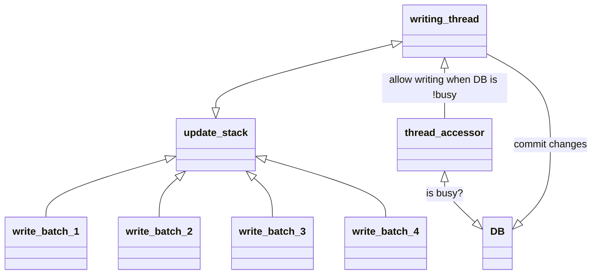

```mermaid
classDiagram
class update_stack
class write_batch_1
class write_batch_2
class write_batch_3
class write_batch_4
class DB
class thread_accessor

update_stack <|-- write_batch_1
update_stack <|-- write_batch_2
update_stack <|-- write_batch_3
update_stack <|-- write_batch_4

thread_accessor <|--|> DB : is busy?
writing_thread <|--|> update_stack 
writing_thread <|-- thread_accessor : allow writing when DB is !busy
writing_thread --|> DB : commit changes
```

