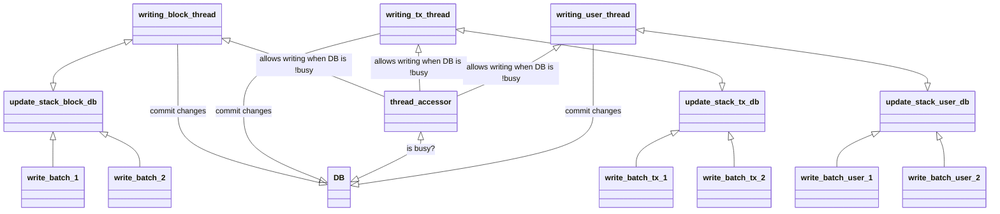

```mermaid
classDiagram
update_stack_block_db <|-- write_batch_1
update_stack_block_db <|-- write_batch_2

writing_block_thread <|--|> update_stack_block_db 
writing_block_thread <|-- thread_accessor : allows writing when DB is !busy
writing_block_thread --|> DB : commit changes

update_stack_tx_db <|-- write_batch_tx_1
update_stack_tx_db <|-- write_batch_tx_2


writing_tx_thread <|--|> update_stack_tx_db 
writing_tx_thread <|-- thread_accessor : allows writing when DB is !busy
writing_tx_thread --|> DB : commit changes


update_stack_user_db <|-- write_batch_user_1
update_stack_user_db <|-- write_batch_user_2

thread_accessor <|--|> DB : is busy?

writing_user_thread <|--|> update_stack_user_db 
writing_user_thread <|-- thread_accessor : allows writing when DB is !busy
writing_user_thread --|> DB : commit changes

```


```markdown
**thread accessor** asks writing_thread for stack's size and choosing thread depending on stack's loadfactor but not more than twice
```


