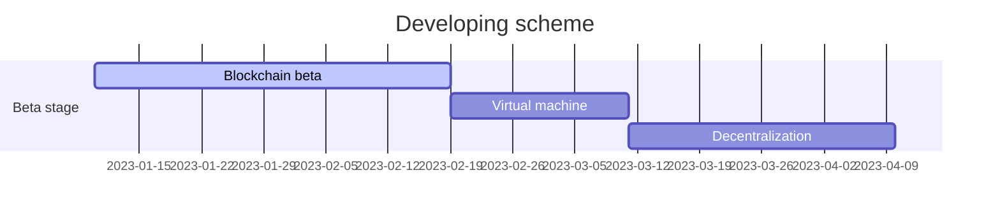

# Requirements

> RAM: >= 2GB 
>
> OS: MacOS, Unix, Windows

# Dependencies 

* boost 1.79.0
* openSSL
* RocksDB

# Installing

### Install dependencies

```bash
#!/bin/bash

wget https://boostorg.jfrog.io/artifactory/main/release/1.79.0/source/boost_1_79_0.tar.gz
tar -xvf boost_1_79_0.tar.gz
rm -rf boost_1_79_0.tar.gz
cd *boost*
./bootstrap.sh 
./b2 install
./b2 install --prefix=/usr/local/lib
sudo wget https://github.com/facebook/rocksdb/archive/refs/tags/v7.4.5.tar.gz
tar -xvf v7.4.5.tar.gz
rm -rf v7.4.5.tar.gz
cd *rocksdb*
sudo apt-get install libgflags-dev libsnappy-dev zlib1g-dev libbz2-dev libzstd-dev
make shared_lib
make install-shared INSTALL_PATH=/usr/local/lib 
```

### Install Unit

```bash
wget https://github.com/Unit-chain/Unit-reborn/archive/refs/tags/v0.3.1.tar.gz
cd *Unit*
... to be continued ...
```


# Roadmap:

- [x] BIP32 & BIP44
- [ ] VM
- [ ] POW
- [ ] ZK-SNARK
- [ ] DECENTRALIZATION
- [ ] GPU counting Proof of Knowledge
- [ ] POW to ZK-GPU-COUNTING PROOF(possible)
- [ ] Pseudonymous


