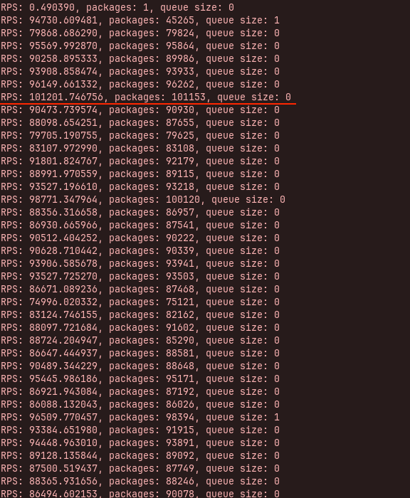

# Requirements

> RAM: >= 2GB 
>
> OS: MacOS, Unix, Windows

# Dependencies 

* boost 1.80.0
* openSSL
* RocksDB

# Donations
e-mail: unit@unitchain.org

BTC(Taproot): bc1pjqaqvruh04wncfcedvntuk0vx9l7kw0t0vem5q964s4gx0nmfu8sj90a34

ETH: 0xF2b924363D4f89fa7b1872A58Dc394a9394E786d

ZEC: t1Ygk4PhkCvLLTMQuPwAoUaZXNss7U5kG63

DASH: Xxpmuz1sNzbQZSSLKLETTbvLsY4vZ7q3se

# Requests Per Second on the new server for Unit User Datagram Protocol(UUDP).

### Tests environment:

- I5 10210U 1.6 GHz
- 16 GB RAM
- HotSpot: Nothing Phone(1)
- Memory usage: 240 kB
- CPU usage: 14%
- Threads: 6
- OS: ZorinOS 16.2 64-bit

