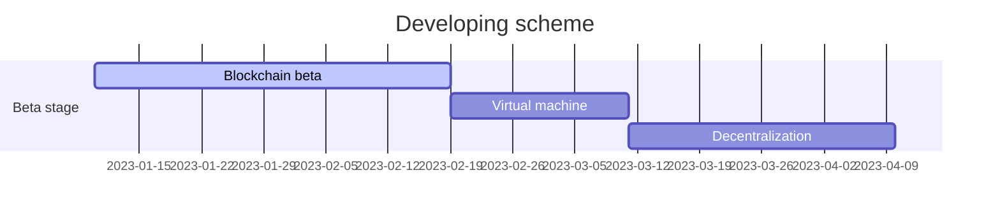

# Requirements

> RAM: >= 2GB 
>
> OS: MacOS, Unix, Windows

# Dependencies 

* boost 1.80.0
* openSSL
* RocksDB

# Donations

BTC(Taproot): bc1pjqaqvruh04wncfcedvntuk0vx9l7kw0t0vem5q964s4gx0nmfu8sj90a34

ETH: 0xF2b924363D4f89fa7b1872A58Dc394a9394E786d

ZEC: t1Ygk4PhkCvLLTMQuPwAoUaZXNss7U5kG63

DASH: Xxpmuz1sNzbQZSSLKLETTbvLsY4vZ7q3se

# Roadmap:

- [x] BIP32 & BIP44
- [ ] VM
- [ ] POW/POS
- [ ] DECENTRALIZATION
- [ ] ZK-SNARK
- [ ] Pseudonymous

